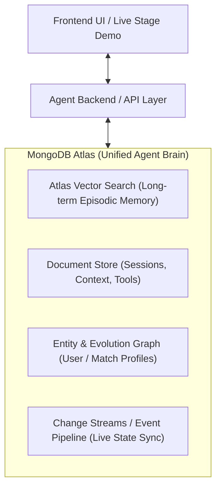

# 🚀 MongoMatch — Build Fest Hackathon Blueprint

## 📌 Hackathon Constraints & Core Objectives
- **Event**: Build Fest — *Build in Less than a Day. Showcase on a Global Stage.*
- **Time Window**: ~4-hour dedicated hacking block.
- **Audience & Judging**: 
  - Round 1: Panel of judges selects Top 3 finalists.
  - Round 2: On-stage live demo for all Build Fest attendees with **real-time audience voting** right before Loud Luxury takes the stage.
- **Winning Criteria**: High visual engagement, rapid & frictionless live demo, immediate "aha!" factor, and deep, legitimate integration with **Agent Memory & Context**.

---

## 🗄️ Database & Cloud Infrastructure (Mandatory)
- **Platform**: **MongoDB Atlas** (M10 Dedicated Tier)
- **Region**: AWS `us-west-1`
- **Specs**: 10 GB Storage, 2 GB RAM, 2 vCPUs
- **Atlas Native Capabilities Leveraged**:
  1. **Atlas Vector Search**: Native $vectorSearch aggregation stage for semantic memory retrieval (no third-party Pinecone/Qdrant/Weaviate needed).
  2. **Operational Document Store**: Multi-turn conversation state, agent scratchpad, step-by-step reasoning logs, user profiles.
  3. **Entity Knowledge & State Evolution**: Dynamic schema updates to track how agent understanding evolves over time.
  4. **Full-Text & Hybrid Search ($search + $vectorSearch)**: Rich filtering across structured attributes (skills, tags, availability) + semantic preferences.
  5. **Atlas Change Streams / Real-time Sync**: Pushing agent memory events directly to the client UI.

---

## 🧠 The Core Narrative: "Agent Memory on a Single Platform"
No bolt-on vector stores, no Redis cache layers, no complex multi-database sync pipelines. **MongoDB Atlas acts as the brain, working memory, long-term episodic archive, and state machine.**

